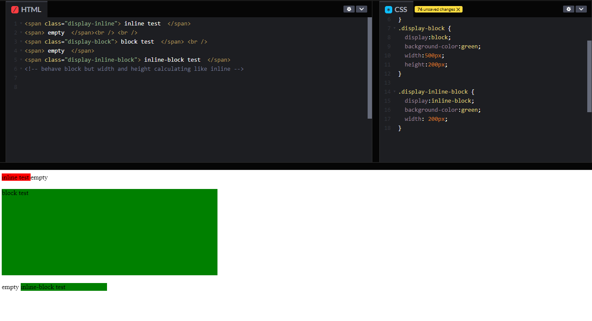

### CSS display Property
* The **display** **CSS** property sets whether an element is treated as a **block or inline element** and the layout used for its children, such as **flow layout, grid or flex**.

```css
/* precomposed values */
display: block;
display: inline;
display: inline-block;
display: flex;
display: inline-flex;
display: grid;
display: inline-grid;
display: flow-root;

/* other value */
display: table;
display: table-row;
display: list-item;
```

## ===> some popular display settings

### display: inline
* Displays an element as inline element (like **span**). Any height and width properties will have no effect

### display: block
* Displays an element as a block element (like **p**).It starts on a new line, and takes up the whole width

### display: inline-block
* Displays an element an inline-level block container. the element itself is formatted as an inline element, but we can apply height and width values



### display: flex
* Display an element as a block container
* it provides flexibility to arrange child elements


### some flex properties
#### **flex**
* we can arrange length of content

```html
<style>
.container {
  background-color:red;
  display:flex;
}

.container > .item {
  background-color: yellow;
  flex:1; /* this provides to shown same length  */
}
</style>

<body>
  <div class="container">
    <div class="item">item 1 </div> <!-- it will shown same length -->
    <div class="item">item 2 </div>
  </div>

</body>
```

* The **flex** property is a shorthand property for: (it will be looked up later)
    * flex-grow
    * flex-shrink
    * flex-basis
* Also, we can use percentage for flex
```css
.flex-container {
  display: flex;
  flex-wrap: wrap;
}

.flex-item-left {
  flex: 50%;
}

.flex-item-right {
  flex: 50%;
}
```

### flex:basis
* Set the initial length of item.
* we can define  pixels, percentages or relative units
* Default value is auto