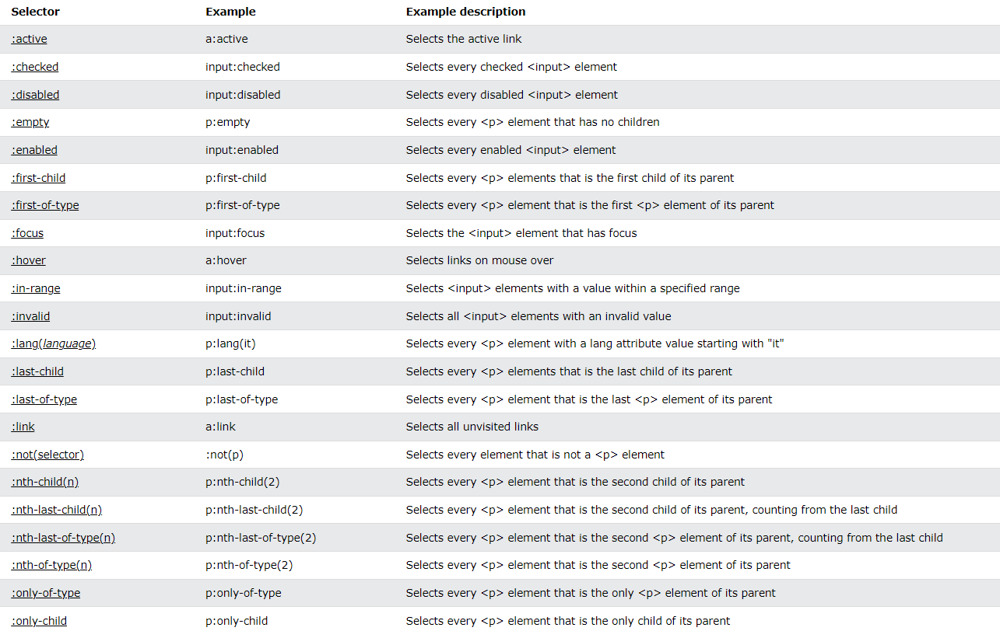
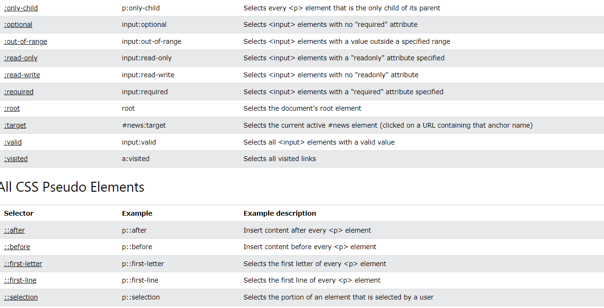

## Pseudo-classes

* it provides to use special state of element.

Some example;
*  mouseover
* visited, unvisited
* focus

### Syntax
Usage of pseudo classes

```css
selector:pseudo-class {
  property: value;
}
```
* links can be displayed in different ways:

```css
/* unvisited link */
a:link {
  color: #FF0000;
}

/* visited link */
a:visited {
  color: #00FF00;
}

/* mouse over link */
a:hover {
  color: #FF00FF;
}

/* selected link */
a:active {
  color: #0000FF;
}
```

* sample tooltip implementation
```css
p {
  display: none;
  background-color: yellow;
  padding: 20px;
}

div:hover p {
  display: block;
}
```
### CSS - The :first-child Pseudo-class
The `:first-child` pseudo-class matches a specified element that is the first of another element.

```css
p:first-child {
  color: blue;
}


<p>This is some text.</p> /* selected */
<p>This is some text.</p>

<div>
  <p>This is some text.</p> /* selected */
  <p>This is some text.</p>
</div>

/* --------------------------------------- */
p i:first-child {
  color: blue;
} 
/* both i are selected */
<p>I am a <i>strong</i> person. I am a <i>strong</i> person.</p>
<p>I am a <i>strong</i> person. I am a <i>strong</i> person.</p>
```

### CSS- The :lang Pseudo-class

The **:lang** pseudo-class allows us to define special rules for different languages.

```html
<html>
<head>
<style>
q:lang(no) {
  quotes: "~" "~";
}
</style>
</head>
<body>

<p>Some text <q lang="no">A quote in a paragraph</q> Some text.</p>

</body>
</html>
```


