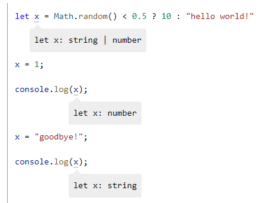
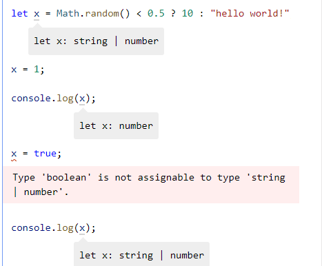

## Narrowing

Let's try to implement function called ***padLeft***.

```ts
function padLeft(padding: number | string, input: string): string {
  throw new Error("Not implemented yet!");
}
```

If **padding** is a **number**, it will treat that as the number of spaces we want to prepend to **input**. If **padding** is a **string**, it should just prepend **padding** to **input**. Let’s try to implement the logic for when padLeft is passed a **number** for **padding**.

```ts
function padLeft(padding: number | string, input: string) {
  return " ".repeat(padding) + input;

/*Argument of type 'string | number' is not assignable to parameter of type 'number'.
  Type 'string' is not assignable to type 'number'. */
}
```


* We will get an error,  because ***repeat*** is accepting number as a type but padding can be string.

* We can fix this issue by checking type of padding

```ts
function padLeft(padding: number | string, input: string) {
  if (typeof padding === "number") {
    return " ".repeat(padding) + input;
  }
  return padding + input;
}
```

* this can be looked like interesting because it's looking completely JS code. special type checking called **type guard**.

* But types script can understand this check and create separate branch and declare it called ***narrowing***.


### ***typeof*** type guards

* "string"
* "number"
* "bigint"
* "boolean"
* "symbol"
* "undefined"
* "object"
* "function"

and also TS check nullable or not.


### The **in** operator narrowing

JS has an operator for determining  if an object has a property with a name. the **in** operator.

```ts
type Fish = { swim: () => void };
type Bird = { fly: () => void };
 
function move(animal: Fish | Bird) {
  if ("swim" in animal) {
    return animal.swim();
  }
 
  return animal.fly();
}
```

### ***Asssignments*** ###

When we assign to any variable, TS looks at the right side of the assignment and the left side appropriately.



Notice that each of these assignments is valid. Although the observed type of ***x*** changed to ***number*** after our first assignment. This is because the declared type of ***x*** - the type that ***x*** started with ***string | number***. 

let's try it out assign boolean.


## Using type predicates ###

If we want to control directly the type, to define a type-guard, we need to define a function hose return type is a ***type predicate***

```ts
function isFish(pet: Fish | Bird): pet is Fish {
  return (pet as Fish).swim !== undefined;
}
```

For above function ***pet is Function*** is our type predicate. A predicate takes the form ***parameterName is Type***, where ***parameterName*** must be the name of a parameter from the current function signature.


Anytime ***isFish*** called with some variable, TS will narrow that variable tı specific type if the original type is compatible.

```ts
// Both calls to 'swim' and 'fly' are now okay.
let pet = getSmallPet();
 
if (isFish(pet)) {
  pet.swim();
} else {
  pet.fly();
}
```

Notice that TS no only knows that ***pet*** is a  ***Fish*** in the  ***if*** branch; it also knows that in the ***else*** branch, you don't have a ***Fish***, so we must have a ***bird***.

we may use the type guard ***isFish*** to filter an array ***Fish | Bird*** and obtain an array of ***Fish***:

```ts
const zoo: (Fish | Bird)[] = [getSmallPet(), getSmallPet(), getSmallPet()];
const underWater1: Fish[] = zoo.filter(isFish);
// or, equivalently
const underWater2: Fish[] = zoo.filter(isFish) as Fish[];
 
// The predicate may need repeating for more complex examples
const underWater3: Fish[] = zoo.filter((pet): pet is Fish => {
  if (pet.name === "sharkey") return false;
  return isFish(pet);
});
```

## SUMMARY
* if we check type with classic JS method (typeof, instance of) it called ***type guard***.
* after we check type in first branch, for other branch TS apply ***type narrowing*** 
* we are using ***type predicate*** to control type directly.